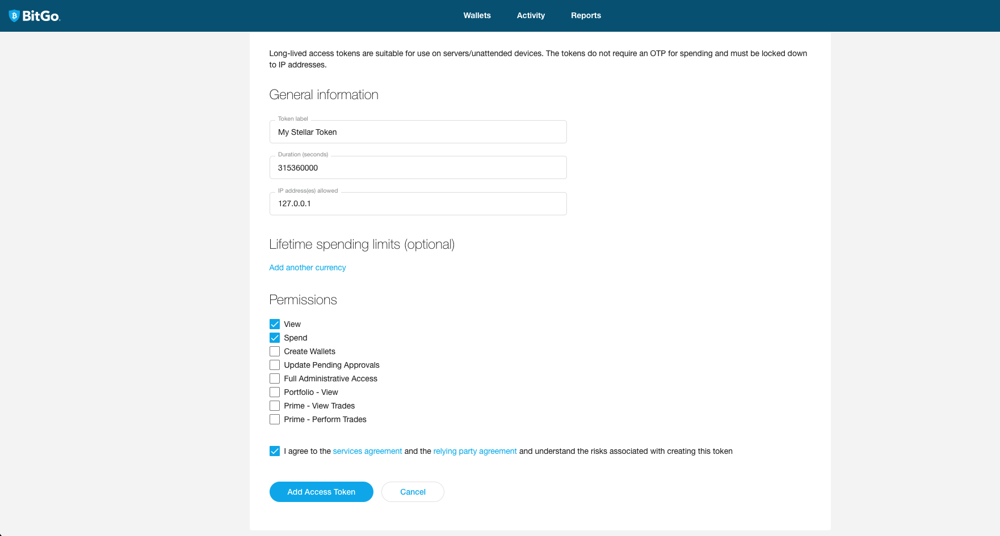

# Django Polaris Custodial

Polaris Custodial is a Django app built to extend Polaris functionalities by providing the possibility of using a custodial wallet as the anchor's supply account. By default, it deliveries a full integration with BitGo's wallet, and at the same time, offers you ways to add and customize other custodial solutions.

## Dependencies

- django-polaris >= 1.4.1
- pycryptodome == 3.10.1

## Installation

```shell
$ pip install django-polaris django-polaris-custodial
```

```python
INSTALLED_APPS = [
    ...
    # polaris dependencies
    "rest_framework",
    "corsheaders",
    "polaris",
    # polaris custodial dependency
    "polaris_custodial",
    ...
]
```

## How to use

### BitGo

To use the BitGo's wallet, it is necessary to import Polaris Custodial from the package and pass it as an argument to the `custodial` parameter in the Polaris' `register_integrations` function.

```python
# apps.py

from django.apps import AppConfig


class MyAppConfig(AppConfig):
    name = "my_app"

    def ready(self):
        from polaris.integrations import register_integrations
        from polaris_custodial.bitgo import BitGoIntegration
        from .integrations import (
            ...
            MyRailsIntegration,
        )

        register_integrations(
            ...,
            rails=MyRailsIntegration(),
            custodial=BitGoIntegration(),
        )
```

On your `settings.py` file you'll need to add the following configuration variables. For improved security, we strongly recommend to add them to Environment Variables to keep them separated from the code.

- **BITGO_API_URL**: Refers to the BitGo's API base URL. Use `https://app.bitgo.com` for production environment and `https://app.bitgo-test.com` for the test environment.
  
- **BITGO_API_KEY**: Refers to the API Key for the BitGo account. It can be generated on your BitGo account by navigating to "Account Settings" -> "Developer Options" -> "Access Tokens". Here, click on the "+" button to add a token. On the following screen, fill in the information about the token that will be created.
  
   **Note**: Do **NOT** add `Lifetime Spending Limits`, as it'll set a maximum lifetime amount to be transacted through this token and will invalidate it up reaching this limit.

    After filling in all the information, your form should look like this:

    

    Upon finishing it, you should receive your `API Key`.

- **BITGO_API_PASSPHRASE**: The specific password for the wallet, to encrypt the user key on BitGo. This password is set when creating the wallet. You can change this password clicking on "Wallets" -> Access your wallet -> "Settings". There you will have a section where you can change the password.
  
- **BITGO_WALLET_ID**: This information can be found by accessing your wallet and going to the "Settings" tab.
  
- **BITGO_STELLAR_COIN_CODE**: Use `xlm` for production environment and `txlm` for test environment.

```python
# settings.py
...

BITGO_API_URL = "https://app.bitgo-test.com"
BITGO_API_KEY = "my_bitgo_api_key"
BITGO_API_PASSPHRASE = "my_bitgo_api_passphrase"
BITGO_WALLET_ID = "my_wallet_id"
BITGO_STELLAR_COIN_CODE = "xlm"
```

After this you are ready to use BitGo as the supply account for your Anchor on Stellar Network.

### Other Custodial Wallet

Using this approach you will need to implement a class which inherits from `polaris.integrations.CustodialIntegration` and override three functions:

- **get_distribution_account**: This function must return your wallet's public key.

- **get_distribution_seed**: This function must return your wallet's private key. **Note**: This is the private key used to sign the transaction on the Anchor side. Depending on your custodial solution it might be the private key of the supply account or the private key from a signer's account.

- **submit_transaction**: This function will submit the transaction to your Custodial Wallet provider. It must return `True` in case of success otherwise `False`. Also, you will need update some fields from the `Transaction` that you receive as a parameter. These fields are: 
  
  - **envelope_xdr**: [External Data Representation (XDR)](https://developers.stellar.org/docs/glossary/xdr/) is a standardized protocol that the Stellar network uses to encode data. After the transaction be sent to Stellar Network it generates a envelope XDR.
  - **paging_token**: A cursor value to use [pagination](https://developers.stellar.org/api/introduction/pagination/).
  - **stellar_transaction_id**: The transaction id from Stellar Network.
  - **status**: Depending on the state of the transaction, you can update it. But, we recommend after finishing everything, you must update to `completed` status.
  - **completed_at**: The moment when the transaction is finished.
  - **amount_out**: Amount that was sent to the user.
  - **pending_execution_attempt**: A boolean that identifies if the transaction was already processed.

  You can see how it was done for `BitGo`'s integration [here](). You can read more about transactions [here](https://developers.stellar.org/api/resources/transactions/object/)

```python
# integrations.py

from polaris.models import Asset, Transaction
from polaris.integrations.custodial import CustodialIntegration


class MyCustodialWalletIntegration(CustodialIntegration):
    def __init__(self):
        super().__init__()
        self.custodial_enabled = True
    
    def get_distribution_account(self, asset: Asset) -> str:
        # Here you will request your Custodial Wallet API to get the Wallet's Public Key.
        # This is the Public Key that will be shown as the supply account.
        # For example: GDBWZJVRRULO23HJQC7LXEZVAPR2OAR2BX2ZGV7QMV5H662H3UA7EQFZ
        ...
        return my_wallet_public_key

    def get_distribution_seed(self, asset: Asset) -> str:
        # Here you will request your Custodial Wallet API to get the Wallet's Private Key.
        # For example: SAZXK7VFNMCUCOA4V6PVXMRXBKJ3LWX7MRXPZINDO33U6MAMR4JHS3HH
        ...
        return my_wallet_public_key

    def submit_transaction(self, transaction: Transaction):
        # Here you will request your Custodial Wallet API to send the transaction to them.
        ...
        if not response.ok:
            return False

        # Proccess everything and update the transaction instance
        ...
        return True
```

After implementing your Custodial Wallet integration, you must register it to the `custodial` parameter on `register_integration` function. See the snippet below as an example:

```python
# apps.py

from django.apps import AppConfig


class MyAppConfig(AppConfig):
    name = "my_app"

    def ready(self):
        from polaris.integrations import register_integrations
        from .integrations import (
            ...
            MyCustodialWalletIntegration,
            MyRailsIntegration,
        )

        register_integrations(
            ...,
            rails=MyRailsIntegration(),
            custodial=MyCustodialWalletIntegration(),
        )
```

With this, you are to go to use your preferred Custodial Wallet as the anchor's supply account.

## Possible Issues

### BitGo's API Needs Unlock error

This error generally occurs when a `Lifetime Spending Limits` value was added to the API Key and it reached the limit, invalidating the Key.

### BitGo's Trustline Error

This error indicates a trustline was not added for the tokenized asset on the BitGo's wallet.
